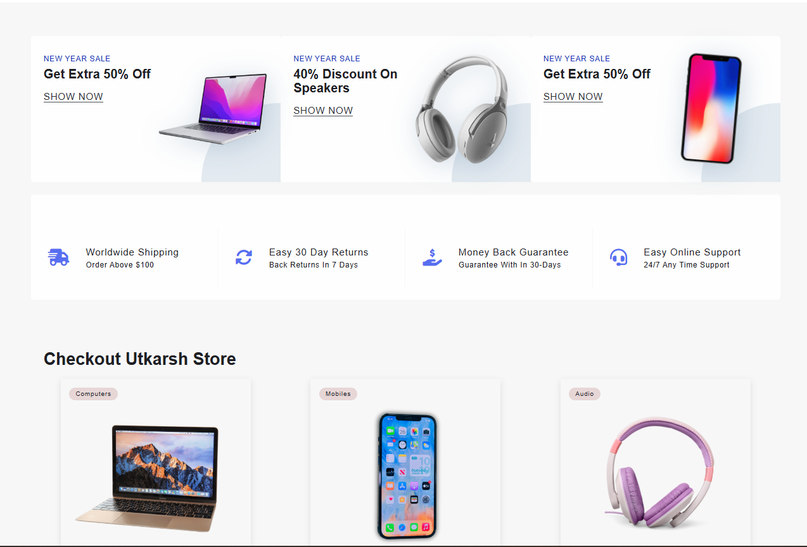
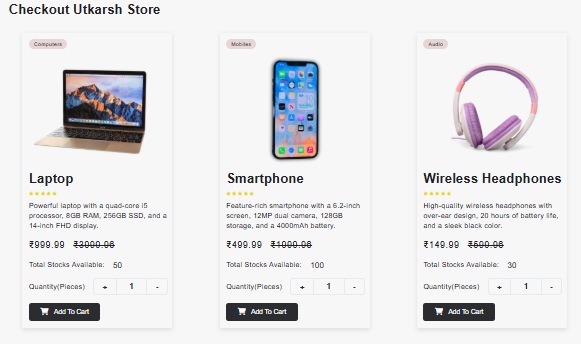
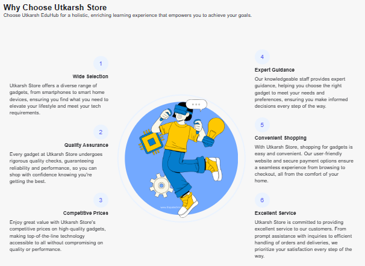
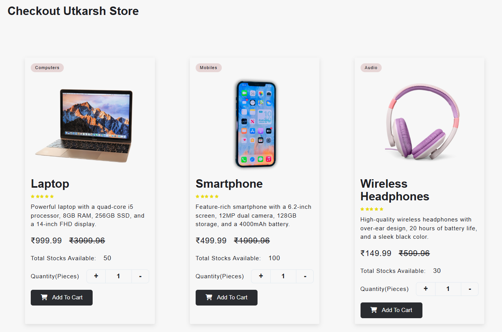
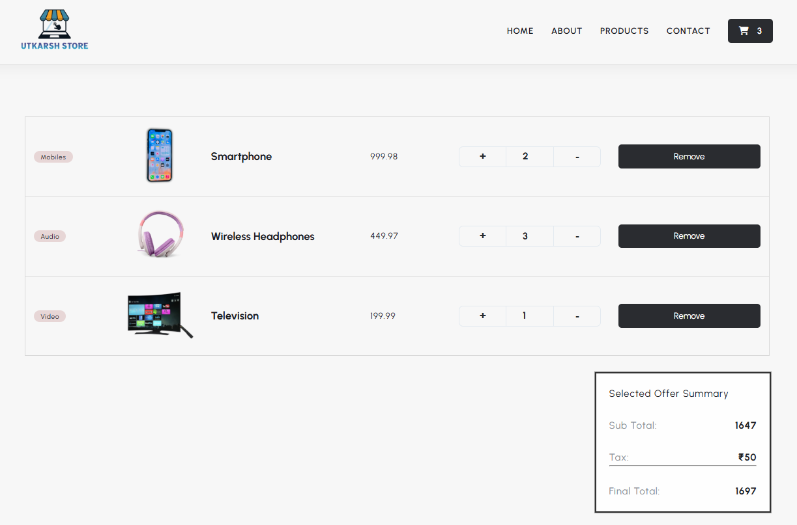

# 🛒 Utkarsh Store

A clean, fast, and fully functional **e-commerce web application** built with vanilla JavaScript and powered by Vite. Browse products across multiple categories, manage quantities, and handle a persistent cart — all without a backend.

---

## 🌐 Live Demo

> https://utkarshstore.netlify.app/

---

## 📸 Screenshots

| Home - Hero Section          | Home - Products              | Home - Footer                |
| ---------------------------- | ---------------------------- | ---------------------------- |
|  |  |  |

| Products Page                   | Cart page                   |
| ------------------------------- | --------------------------- |
|  |  |

---

## ✨ Features

- 🏠 **Home Page** — Hero section with featured product categories (Mobiles, Laptops, Audio, Wearables, TVs)
- 🃏 **Dynamic Product Cards** — Products rendered from a local JSON API using `<template>` cloning
- 🛒 **Add to Cart** — Add products with quantity selection; duplicate entries are handled gracefully
- 🔢 **Quantity Toggle** — Increment/decrement product quantity before adding to cart
- 💾 **Persistent Cart** — Cart data is stored in `localStorage` and survives page refreshes
- 🔄 **Real-time Cart Count** — Cart icon updates instantly on every add/remove action
- ➕ **Cart Management** — Update quantities and remove individual products from the cart
- 💰 **Live Price Calculation** — Total price updates dynamically based on quantity changes
- 🔔 **Toast Notifications** — User-friendly feedback on add-to-cart and remove actions
- 📄 **Multi-page Layout** — Separate pages for Home, Products, Cart, About, and Contact
- 🦶 **Dynamic Footer** — Footer injected via JavaScript across all pages

---

## 🗂️ Project Structure

```
jsproject/
├── index.html                  # Home page
├── products.html               # All products listing page
├── addToCart.html              # Cart / checkout page
├── about.html                  # About page
├── contacts.html               # Contact page
├── style.css                   # Global stylesheet
│
├── api/
│   └── products.json           # Local product data (mock API)
│
├── public/
│   └── images/                 # All product & UI images
|
├── screenshots
│
├── main.js                     # App entry point — loads products on home page
├── homeProductsCards.js        # Renders product cards using <template>
├── homeQuantityToggle.js       # Handles +/- quantity buttons on product cards
├── addToCart.js                # Core cart logic — add products to localStorage
├── getCartProducts.js          # Reads cart data from localStorage
├── fetchQuantityFromCartLS.js  # Syncs quantity from cart on page load
├── showAddToCartCards.js       # Renders cart items on the cart page
├── removeProdFromCart.js       # Removes a product from cart
├── incrementDecrement.js       # Quantity controls inside the cart page
├── updateCartProductsTotal.js  # Recalculates and displays cart total
├── updateCartValue.js          # Updates cart icon count in the navbar
├── showToast.js                # Toast notification utility
├── footer.js                   # Injects footer HTML dynamically
│
├── package.json
├── vite.config.js
└── README.md
```

---

## 🛠️ Tech Stack

| Technology            | Purpose                                |
| --------------------- | -------------------------------------- |
| **HTML5**             | Page structure & `<template>` elements |
| **CSS3**              | Styling & responsive layout            |
| **JavaScript (ES6+)** | All interactivity & logic              |
| **Vite 7**            | Dev server, bundling & fast HMR        |
| **localStorage**      | Client-side cart persistence           |
| **JSON**              | Local mock product API                 |

---

## 🚀 Installation & Setup

### Prerequisites

- [Node.js](https://nodejs.org/) (v16 or above)
- npm (comes with Node.js)

### Steps

1. **Clone the repository**

   ```bash
   git clone https://github.com/your-username/utkarsh-store.git
   cd utkarsh-store
   ```

2. **Install dependencies**

   ```bash
   npm install
   ```

3. **Start the development server**

   ```bash
   npm run dev
   ```

   The app will be live at `http://localhost:5173`

4. **Build for production**

   ```bash
   npm run build
   ```

5. **Preview the production build**
   ```bash
   npm run preview
   ```

---

## 🧩 How It Works

1. **Products** are loaded from `api/products.json` and rendered dynamically using HTML `<template>` cloning — no frameworks needed.
2. **Cart** operations (add, remove, update) all read from and write to `localStorage`, making the cart persistent across sessions.
3. **Toast notifications** give instant feedback to the user whenever they interact with the cart.
4. **Vite** handles ES module imports across all JS files, enabling a clean modular codebase.

---

## 📦 Product Categories

- 💻 Computers / Laptops
- 📱 Mobiles / Smartphones
- 🎧 Audio (Headphones & Speakers)
- ⌚ Wearables (Smartwatches)
- 📺 Televisions

---

## 🤝 Contributing

Contributions are welcome! Feel free to open an issue or submit a pull request.

1. Fork the project
2. Create your feature branch (`git checkout -b feature/AmazingFeature`)
3. Commit your changes (`git commit -m 'Add some AmazingFeature'`)
4. Push to the branch (`git push origin feature/AmazingFeature`)
5. Open a Pull Request

---

## 📄 License

This project is open source and available under the (LICENSE).

---

> Built with ❤️ by **Utkarsh**
